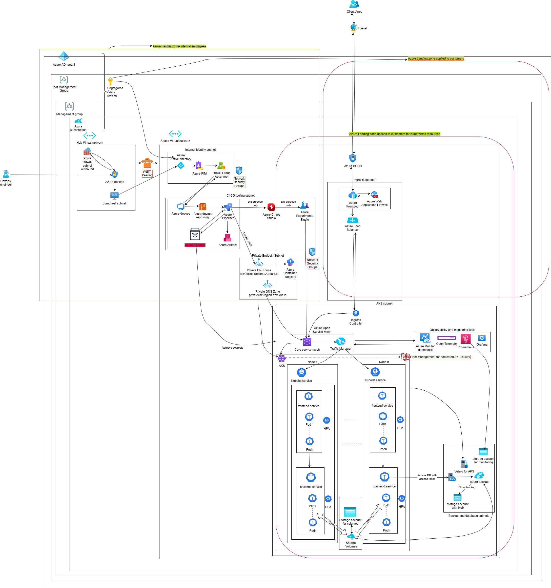

# 📘 Production-Ready Azure Kubernetes (AKS) Cluster: Shared vs Dedicated Deployment Models

This guide explains how to architect and manage a **production-ready AKS cluster**, covering **shared vs dedicated cluster models**, including **monitoring**, **security**, **disaster recovery**, and **namespace organization**.

## ✅ **Recommended Order for Azure L7 + L3/L4 Protection**

### 📌 **Correct Order:**

```
Client ➝ Azure DDoS Protection ➝ Azure Front Door / Application Gateway (with WAF) ➝ Azure Load Balancer ➝ AKS Ingress ➝ Services
```

---

## 🔍 Why This Order?

| Layer | Component                                | Purpose                                                                |
| ----- | ---------------------------------------- | ---------------------------------------------------------------------- |
| L3/L4 | **Azure DDoS Protection**                | Protects against volumetric, protocol, and resource exhaustion attacks |
| L7    | **Azure Front Door / App Gateway + WAF** | Filters malicious HTTP/S requests (SQLi, XSS, bot protection)          |
| L4    | **Azure Load Balancer**                  | Distributes traffic to backends (AKS nodes, VMs, etc.)                 |

---

### ❗ Placing **WAF before DDoS Protection** (which you mentioned):

That’s **not recommended** because:

* **WAF operates at L7**, and cannot handle **volumetric (L3/L4)** attacks like SYN floods or UDP reflection.
* If DDoS protection is placed *after* WAF, the attack reaches and potentially overwhelms your WAF/App Gateway.

---

## 🔐 Recommended Architecture for protection against DDOS atatcks (Simplified Flow)

```text
[Internet Traffic]
      ↓
 Azure DDoS Protection (Network-level)
      ↓
Azure Front Door / App Gateway (with WAF - App-level)
      ↓
Azure Load Balancer (TCP-level)
      ↓
Ingress Controller (NGINX) in AKS
      ↓
K8s Services & Pods
```


---

### ✅ Fix Checklist

## 🧱 Overview



A production-grade Kubernetes cluster must be:

- ✅ Monitored (Logging, Tracing, Alerts)
- ✅ Secured (RBAC, DDoS, WAF, PIM)
- ✅ Scalable (HPA, Cluster Autoscaler)
- ✅ Highly Available (Multi-AZ / Multi-Region)
- ✅ Disaster Recovery-ready (Chaos Engineering + Velero)
- ✅ Secrets Protected (Azure Key Vault or Vault)
```

# 📘 Production-Ready Azure Kubernetes (AKS) Cluster: Shared vs Dedicated Deployment Models

This guide explains how to architect and manage a **production-ready AKS cluster**, covering **shared vs dedicated cluster models**, including **monitoring**, **security**, **disaster recovery**, and **namespace organization**.

---

## 🧱 Overview

A production-grade Kubernetes cluster must be:

- ✅ Monitored (Logging, Tracing, Alerts)
- ✅ Secured (RBAC, DDoS, WAF, PIM)
- ✅ Scalable (HPA, Cluster Autoscaler)
- ✅ Highly Available (Multi-AZ / Multi-Region)
- ✅ Disaster Recovery-ready (Chaos Engineering + Velero)
- ✅ Secrets Protected (Azure Key Vault or Vault)

---

## 🔄 Shared vs Dedicated AKS Clusters

### 🟦 Shared Kubernetes Cluster

> Ideal for **multi-tenant environments** (teams, apps, stages) hosted in a shared AKS setup within a **Shared VNet/VPC**.

#### ✅ Use Case:
- Cost-optimized multi-team environments
- Shared infrastructure and monitoring

#### 📌 Key Architecture Features:
- Shared **Azure Front Door + WAF**
- Shared **Azure Load Balancer**
- Shared **NGINX Ingress Controller**
- **Azure DDoS Protection (L3/L4)**
- **Azure Active Directory RBAC** with **PIM/Okta/CyberArk** access

#### 📁 Namespaces:
| Namespace        | Purpose                                           |
|------------------|---------------------------------------------------|
| `team-a-dev`     | Team A development workload                      |
| `team-b-prod`    | Team B production environment                    |
| `monitoring`     | Shared observability stack (Prometheus, etc.)    |
| `networking`     | Ingress, cert-manager, load balancer             |
| `ci-cd`          | Shared CI/CD tools and agents                    |

#### 🔐 Security Model:
- Azure AD + RBAC per namespace
- Network Policies isolate traffic
- Container image scanning in CI
- Rate limiting enforced via Ingress

#### 📊 Observability:
- Prometheus
- Elasticsearch
- Azure Monitor Logs
- Alerting via PagerDuty

---

### 🟩 Dedicated Kubernetes Cluster

> Ideal for **isolated teams** or **high-compliance** workloads that require total infrastructure separation.

#### ✅ Use Case:
- High compliance (Finance, Healthcare)
- Business unit-level isolation
- Full performance control

#### 📌 Key Architecture Features:
- Dedicated Azure Front Door + WAF + LB
- Isolated AKS cluster per use case
- RBAC scoped to entire cluster or namespace

#### 📁 Namespaces:
| Namespace        | Purpose                                           |
|------------------|---------------------------------------------------|
| `production`     | Core application workloads                       |
| `monitoring`     | Full observability stack                         |
| `infrastructure` | Ingress, cert-manager, external DNS              |
| `ci-cd`          | Helm/ArgoCD/GitOps tooling                       |

#### 🔐 Security Model:
- Dedicated Azure Key Vault
- Azure PIM for JIT access
- Admission policies for pod limits, rate limiting
- Rootless container policy enforcement

#### 📊 Observability:
- Prometheus, Grafana
- Elasticsearch / Loki
- Azure Monitor + Activity Logs
- Istio mesh (optional) with Jaeger, Kiali

---
## AKS cluster models
Great question!

Using **AKS Fleet Manager** depends on **how your AKS clusters are structured** (dedicated vs shared) and **what level of consistency, governance, and workload distribution** you need.

---

### ✅ **What Is AKS Fleet Manager?**

AKS Fleet Manager allows you to:

* **Group and manage multiple AKS clusters**
* Apply **updates**, **deploy workloads**, and **enforce configurations** across all clusters
* Standardize **GitOps**, **add-ons**, **namespaces**, and **policy** deployment
* Optimize **multi-cluster routing** and **placement policies**

---

## 🔄 Use Case Comparison: Shared vs Dedicated Clusters

### 🟩 **Dedicated AKS Clusters**

> Each team, business unit, or environment gets **its own isolated AKS cluster**.

✅ **Recommended to use AKS Fleet Manager**

**Why?**

* You need to **manage consistency** across many clusters.
* You want to enforce **standard security policies**, **namespaces**, and **monitoring tools** across dedicated environments.
* Enables centralized **GitOps-based deployment** for app/platform teams across clusters.
* Helps orchestrate **rollouts**, **disaster recovery**, and **upgrades** across production, staging, or regionally-distributed clusters.

✅ **Typical Features Used:**

* Workload propagation (e.g., logging agent, cert-manager)
* Add-on consistency
* Placement across geo-replicated clusters
* Centralized policy/GitOps deployment
* Centralized monitoring enablement

---

### 🟦 **Shared AKS Clusters**

> Multiple teams share **namespaces** inside a single AKS cluster.

❌ **Fleet Manager NOT typically needed**

**Why?**

* Only one or a few clusters exist; teams are isolated via **namespaces**, **network policies**, and **RBAC**.
* You don't need to propagate workloads/configs across clusters.
* GitOps and policy enforcement can be done **within the shared cluster** itself (e.g., using ArgoCD, FluxCD, Kyverno).

However…

🔸 **If you operate a mix of shared clusters**, you *may* use Fleet Manager for:

* Enforcing **baseline monitoring**
* Deploying **common workloads** like logging, AAD pod identity, or secrets CSI driver
* **Disaster recovery coordination**

---

## ✅ When to Use AKS Fleet Manager

Use Fleet Manager if:

| Criteria                                                | Use Fleet Manager? |
| ------------------------------------------------------- | ------------------ |
| You operate **>1 AKS cluster**                          | ✅ Yes              |
| You want **centralized GitOps config enforcement**      | ✅ Yes              |
| You want **regional failover / DR**                     | ✅ Yes              |
| You run **multi-tenant namespaces in a single cluster** | ❌ Not needed       |
| You want to deploy the same app in 3+ clusters          | ✅ Yes              |
| You use **Kubernetes Add-ons** and want uniformity      | ✅ Yes              |

---

## 📘 Microsoft Guidance

According to Microsoft:

> “Fleet Manager is best used in **dedicated cluster models**, where teams or environments are deployed to their own clusters, and platform consistency is key.”

Source: [AKS Fleet Manager docs](https://learn.microsoft.com/en-us/azure/aks/fleet-overview)

---

### 🛠 Summary

| Feature                                 | Shared AKS Cluster   | Dedicated AKS Clusters |
| --------------------------------------- | -------------------- | ---------------------- |
| Central GitOps Deployment               | ❌ Done per namespace | ✅ Done via Fleet       |
| Add-on Consistency Across Clusters      | ❌ Manual             | ✅ Fleet-supported      |
| Regional/Environment Cluster Management | ❌ Not needed         | ✅ Critical use case    |
| Namespace Management                    | ✅ Core feature       | ✅ Optional per cluster |
| Policy Enforcement                      | ✅ Per cluster        | ✅ Fleet-managed        |

---

Would you like a diagram comparing Fleet Manager deployment in shared vs dedicated models?


---

## 🔍 Architecture-Wide Features

| Feature                   | Shared Cluster                           | Dedicated Cluster                         |
|---------------------------|-------------------------------------------|--------------------------------------------|
| **DDoS + WAF**           | Shared setup                             | Cluster-specific setup                     |
| **Ingress Controller**   | Shared (NGINX)                           | Dedicated per cluster                      |
| **Monitoring Namespace** | Shared across all namespaces             | Dedicated and isolated                     |
| **Secrets**              | Azure Key Vault (multi-tenant)           | Dedicated Key Vault or HashiCorp Vault     |
| **CI/CD Pipelines**      | Shared pipelines                         | Dedicated pipelines                        |
| **Disaster Recovery**    | Velero per namespace                     | Velero + Azure Chaos Studio cluster-wide   |
| **Scaling**              | HPA/CA with node/pod limits              | Full autoscaler control                    |

---

## ⚠️ Security Practices

- RBAC enforced per namespace via Azure AD
- Apply Azure landing zones
├── Landing Zones MG
│   ├── Dev Subscriptions
|   ├── Test Subscriptions 
│   └── Prod Subscriptions

- Create a governanace model to apply segragated Azure policies
  
Tenant Root MG
├── Platform MG
│   ├── Networking Subscription
│   └── Identity Subscription
└── Sandbox MG
 

| Level              | Purpose                                                               | Who Should Manage?                 |
| ------------------ | --------------------------------------------------------------------- | ---------------------------------- |
| **Tenant Root**    | Enforce baseline policies across **all MGs and Subs**                 | Central Security Team              |
| **Root MG**        | Policies for all subscriptions (e.g., tag compliance, resource locks) | Platform Governance Team           |
| **MG Level**       | Apply policies for apps in same business unit or environment          | Business Unit Security Lead        |
| **Subscription**   | Specific compliance or workload policies                              | Subscription Owners / DevOps teams |
| **Resource Group** | App-specific policies (e.g., enforce diagnostic settings)             | Application DevOps Team            |


- Temporary access via **Azure PIM**, **Okta**, **CyberArk**
- Container image scanning on `docker push`
- Admission controllers preventing the followings :
  - Pods with `replicas > 10` unless approved
  - Root containers
  - Insecure or misconfigured manifests

- Apply network security groups in teh subnets of the spoke VNET
  To enable secure and functional communication in between the subnets in a Hub-Spoke Azure network**, where **AKS is deployed in a spoke subnet**, you must define **inbound and outbound NSG rules** for **AKS node subnet** that allow:
    **Control-plane traffic (from Azure)**
    **Load balancer traffic**
    **App Gateway or internal ingress**
    **Private endpoints / DNS / CI/CD agents**
    **Azure Monitor **
    **Grafana**
    **Open Service Mesh**
    **Azure Container Registry**
    **Azure DNS** 

  ### ✅ NSG Rules for AKS Subnet (Communication with Other Subnets)

  Apply these rules to the **AKS node subnet** NSG:


  ##### 🔽 Inbound Rules (to AKS Nodes)

| Priority | Name                       | Port(s)       | Source                    | Protocol | Description                                              |
| -------- | -------------------------- | ------------- | ------------------------- | -------- | -------------------------------------------------------- |
| 100      | Allow-Azure-LB-HealthProbe | `*`           | `AzureLoadBalancer`       | Any      | Required for Azure Load Balancer health probes           |
| 110      | Allow-Kubelet              | `10250`       | `VirtualNetwork`          | TCP      | Kubelet metrics, needed by control plane and monitoring  |
| 120      | Allow-NodePort             | `30000-32767` | `VirtualNetwork`          | TCP      | Optional: NodePort service exposure (internal only)      |
| 130      | Allow-AppGW-to-AKS         | `80,443`      | `App Gateway Subnet`      | TCP      | Web traffic from Application Gateway to AKS ingress      |
| 140      | Allow-PrivateEndpoint      | `443`         | `Private Endpoint Subnet` | TCP      | Communication from private services (e.g. ACR, KeyVault) |
| 150      | Allow-Bastion-SSH (opt.)   | `22`          | `Bastion Subnet` or IP    | TCP      | Optional SSH access via Bastion for troubleshooting      |
To enable **observability tools** (Prometheus, Grafana, OpenTelemetry) and **Azure Open Service Mesh (OSM)** to function properly in your AKS cluster hosted in a **spoke subnet**, you need to extend your **NSG rules** accordingly.
------------------------------------------------------ |
| 160      | Allow-Prometheus-Scrape | `9100, 10250` | `VirtualNetwork` | TCP      | Node exporter & kubelet metrics scraping               |
| 170      | Allow-Grafana-Access    | `3000`        | `VirtualNetwork` | TCP      | Access to Grafana dashboards (if exposed internally)   |
| 180      | Allow-OTel-Collector    | `4317,4318`   | `VirtualNetwork` | TCP      | OpenTelemetry (gRPC + HTTP receiver ports)             |
| 190      | Allow-OSM-Envoy-Probes  | `15000,15001` | `VirtualNetwork` | TCP      | OSM Envoy proxy ports used for metrics & control plane |


#### 🔼 Outbound Rules (from AKS Nodes for enablign monitoring and observability tools)

| Priority | Name                      | Port(s)  | Destination                | Protocol | Description                                             |
| -------- | ------------------------- | -------- | -------------------------- | -------- | ------------------------------------------------------- |
| 100      | Allow-API-Server-Out      | `443`    | `AKS Control Plane` (FQDN) | TCP      | Required for kubelet to communicate with API server     |
| 110      | Allow-AppGW-Return        | `80,443` | `App Gateway Subnet`       | TCP      | Response traffic to App Gateway                         |
| 120      | Allow-PrivateEndpoint-Out | `443`    | `Private Endpoint Subnet`  | TCP      | Access to ACR, Key Vault, DNS, etc.                     |
| 130      | Allow-Monitoring          | `443`    | `Azure Monitor`            | TCP      | Log and metric export to Azure Monitor                  |
| 140      | Allow-Azure-DNS           | `53`     | `168.63.129.16`            | UDP      | Azure-provided DNS resolution                           |
| 150      | Allow-Internet            | `443`    | `Internet` *(optional)*    | TCP      | Required only if AKS pulls images or APIs from internet |
| 160      | Allow-Metrics-Export   | `443`      | Azure Monitor / LogAnalytics            | TCP      | Export metrics/logs to Azure Monitor (or 3rd party)     |
| 170      | Allow-OSM-Controller   | `443`      | OSM Controller FQDN/IP                  | TCP      | Allow sidecar and AKS node to talk to OSM control plane |
| 180      | Allow-Grafana-Alerting | `443`      | Alertmanager / Email / PagerDuty        | TCP      | External alerts (if applicable)                         |
| 190      | Allow-OTel-Exporters   | `4317,443` | Tracing backends (e.g., Jaeger, Zipkin) | TCP      | Tracing export   


##### 🛡️ Additional Notes

* Replace `App Gateway Subnet`, `Private Endpoint Subnet`, and `Bastion Subnet` with actual IP ranges or NSG service tags if available.
* You can **scope rules tighter** using Service Tags (e.g., `AzureKubernetesService`, `VirtualNetwork`, `Internet`, `AzureCloud`).
* **Avoid wildcard `*`** unless required for `AzureLoadBalancer` or `health probes`.
* **Use UDRs** (User Defined Routes) if you route traffic via Azure Firewall.


##### 🔧 Optional: NSG Flow Diagram

```
App Gateway Subnet     ---> AKS Subnet: Allow 80/443
CI/CD Subnet           ---> AKS Subnet: Allow 443 (API access)
Private Endpoint Subnet ---> AKS Subnet: Allow 443 (ACR, KeyVault)
Azure Load Balancer    ---> AKS Subnet: Allow Any (Health probes)
AKS Subnet             ---> Azure Monitor: Allow 443
AKS Subnet             ---> Private DNS: Allow 53 (UDP)
```


---

## 📦 Observability Stack (Monitoring Namespace)

| Tool           | Purpose                       |
|----------------|-------------------------------|
| **Prometheus** | Metrics scraping & alerting   |
| **Elasticsearch** | Log indexing and search    |
| **Azure Monitor** | Cluster-wide integration    |
| **PagerDuty**  | Critical alerting trigger     |
| **OpenTelemetry** | Unified tracing            |
| **Jaeger**     | Distributed tracing           |
| **Kiali**      | Istio mesh visualization (optional) |

---

## ☁️ Disaster Recovery & Chaos Engineering

| Feature                     | Chaos Monkey                        | Azure Chaos Studio                    |
|-----------------------------|--------------------------------------|----------------------------------------|
| **Kubernetes Support**      | ❌ Not native                        | ✅ Native to AKS                       |
| **Security & Compliance**   | ❌ Manual setup                      | ✅ Built-in RBAC, logs, policy         |
| **Cost**                    | ✅ Free, self-hosted                 | ⚠️ Pay-as-you-go, no infra to manage  |
| **Reliability**             | ⚠️ Risk of misconfig                | ✅ Safe, scoped experiments            |
| **Time to Implement**       | ⏱️ High effort                      | ✅ Low via Portal/CLI/Bicep            |
| **Recovery Time**           | ❌ Hard to automate                  | ✅ Integrated recovery simulations     |

✅ **Recommended for AKS**:  
Use **Azure Chaos Studio** + **Velero** + **Azure Monitor** for end-to-end fault injection, recovery testing, and disaster simulations.

---

## 🔒 Secret Management

- **Azure Key Vault** integration in all environments
- Optional: **HashiCorp Vault** in `infrastructure` namespace
- Secrets mounted via CSI drivers or environment variables

---

## 🔁 Scalability

- **Horizontal Pod Autoscaler (HPA)** for apps
- **Cluster Autoscaler** for node pool scaling
- Restricted replica count per namespace (default ≤10)

---

## 💾 Backup Strategy

- **Velero** for etcd config and persistent volumes
- Cluster-wide and namespace-scoped backups
- Disaster restore workflows tested with Chaos Studio

---

## ✅ Summary

A production-ready AKS deployment—whether **shared** or **dedicated**—must follow strict practices for:
   ** - security**
   ** - observability**
   ** - autoscaling**
   ** - availability across zones and regions**. 
Namespaces play a critical role in organizing workloads, ensuring policy enforcement, and supporting shared services like monitoring.

For high-compliance and multi-zone resilience, **dedicated AKS clusters** with scoped namespaces and managed chaos testing provide the most robust solution.

---
Yes, **Azure Backup** can be used to back up and restore data from **some NoSQL databases**, but with **important caveats**. Here's a breakdown depending on the NoSQL database you're referring to:

---

### ✅ **Supported Scenarios (Native Integration)**

#### 1. **Azure Cosmos DB (NoSQL)**

Azure Backup has **native support for Azure Cosmos DB** (NoSQL API), including:

* **Point-in-time restore** capabilities.
* **Incremental backups**.
* **Automatic backup policy** configuration.

> 🟢 Use **Azure Backup Center** or **Azure Portal** to manage backups for Cosmos DB.

---

### ⚠️ **For Other NoSQL Databases (Non-Azure-hosted or Self-managed)**

Examples: **MongoDB**, **Cassandra**, **Couchbase**, **Redis**, etc.

Azure Backup **does not have native support** for these databases, but you have alternative options:

#### Option 1: **Use Azure Backup for VMs or Files**

* If your NoSQL DB runs on a **VM**, you can back up the entire VM.

  * Pros: Simple to set up.
  * Cons: No database-aware restore (not granular).

* Or back up specific **directories** or **data folders** using file-level backup.

#### Option 2: **Use Custom Backup Scripts + Azure Blob Storage**

* Create scheduled tasks or cron jobs that:

  * Export/backup the NoSQL database (e.g., `mongodump`, `cqlsh`, etc.).
  * Upload the backup file to **Azure Blob Storage** or **Azure Files**.
* Use **Azure Backup** to protect the storage account or files.

#### Option 3: **Use Azure Backup Server (MABS) or Azure Recovery Services Agent**

* Supports **file/folder-level backups**, not NoSQL-aware.
* Useful for **on-prem NoSQL servers**, but still lacks app-awareness.

---

### ✅ Best Practice Recommendation

For **mission-critical NoSQL workloads not natively supported by Azure Backup**, it's recommended to:

1. Use the **database’s built-in backup tools**.
2. Store the backups in **Azure Blob Storage**.
3. Protect the storage account with **Azure Backup** or **Lifecycle Management** for retention.
4. Use **Azure Site Recovery (ASR)** for disaster recovery if using VMs.

---

### Summary

| NoSQL DB Type        | Native Azure Backup Support | Recommended Approach                           |
| -------------------- | --------------------------- | ---------------------------------------------- |
| Azure Cosmos DB      | ✅ Yes                       | Use Azure Backup Center                        |
| MongoDB (on VM)      | ❌ No                        | Use VM or file-level backup + custom scripts   |
| Cassandra (on VM)    | ❌ No                        | Use native backup tools + blob storage         |
| Redis (Azure Cache)  | ❌ No                        | Use Redis export + backup storage manually     |
| Self-hosted NoSQL DB | ❌ No                        | Combine native dumps with Azure Storage backup |

---

## ✅ Best Practices

| Concern                  | Recommendation                                                                           |
| ------------------------ | ---------------------------------------------------------------------------------------- |
| **DDoS Resilience**      | Always enable **Azure DDoS Protection Standard** on your VNet                            |
| **App-Layer Protection** | Use **Azure Front Door** or **App Gateway** with **WAF** in detection or prevention mode |
| **Global Reach**         | Prefer **Azure Front Door** for global CDN, caching, and SSL offload                     |
| **Private AKS**          | Combine with **Private Link**, **NSGs**, and **Azure Firewall** if internal only         |


### 💡 Summary

* Apply azure policies
* Apply Landing zones for differenciatign in between client access and internal employees access
* **DDoS Protection** should always be the **first line of defense** to filter out L3/L4 attacks.
* **WAF** should sit **after DDoS**, to inspect and block malicious **HTTP(S)** traffic.
* Then comes the **Load Balancer**, followed by **Ingress** and **AKS services**.


